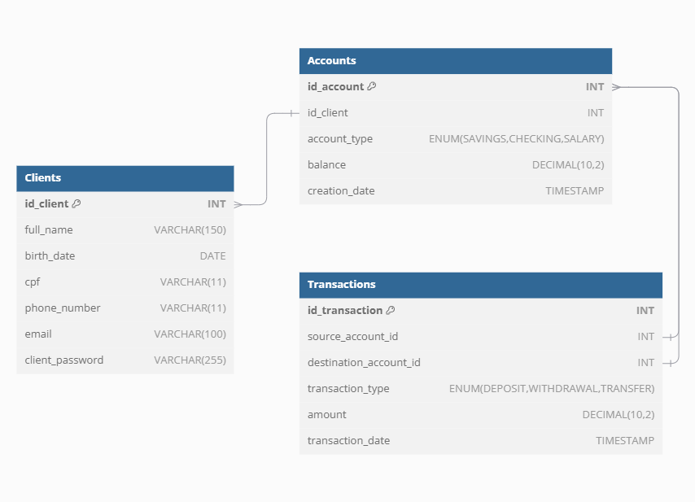

# Modelo ER do Sistema Bancário

Este documento apresenta o diagrama ER utilizado no sistema bancário, com uma breve descrição das tabelas e seus relacionamentos.

## Diagrama ER
Abaixo está o diagrama que representa o banco de dados do sistema:

## Descrição das Tabelas

### **1. Clients**
Tabela responsável por armazenar as informações dos clientes, como:
- Nome completo
- Data de nascimento
- CPF
- Telefone
- Email
- Senha para login no sistema

### **2. Accounts**
Tabela que representa as contas bancárias associadas aos clientes. As contas podem ser de tipos diferentes:
- `SAVINGS`: Conta poupança.
- `CHECKING`: Conta corrente.
- `SALARY`: Conta salário.

A tabela também armazena o saldo e a data de criação.

### **3. Transactions**
Tabela que registra as transações realizadas no sistema, como:
- Depósitos
- Saques
- Transferências entre contas

Cada transação possui os seguintes atributos:
- Conta de origem
- Conta de destino (opcional, para transferências)
- Tipo de transação
- Valor
- Data e hora

## Relacionamentos
- Um cliente pode ter várias contas.
- Uma conta pode ser a origem ou o destino de várias transações.
